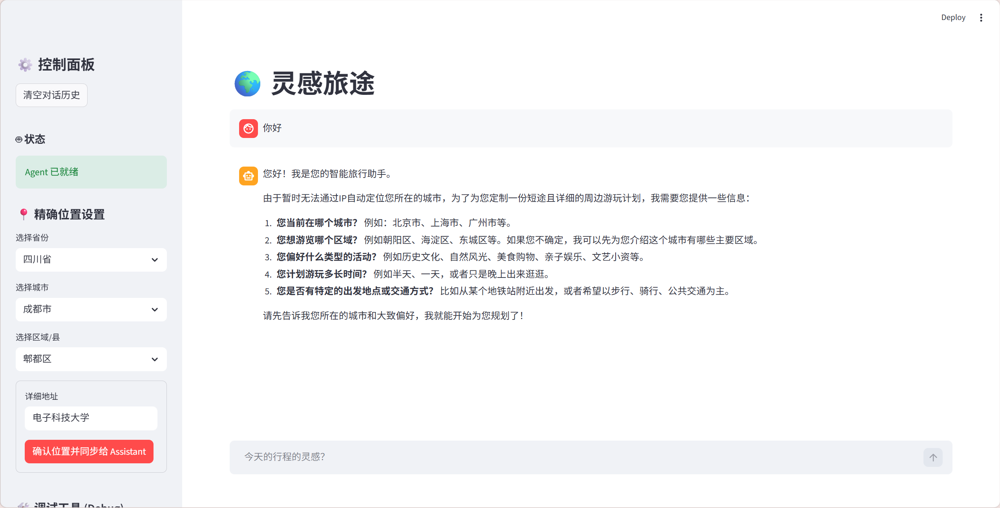
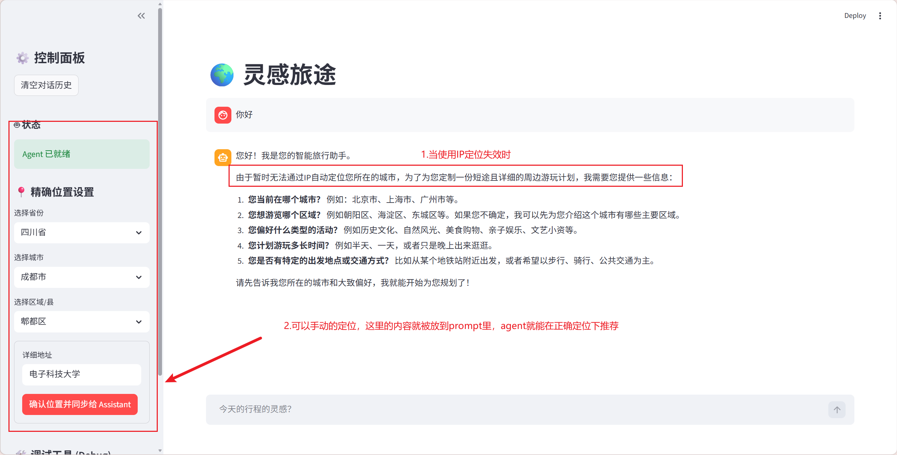
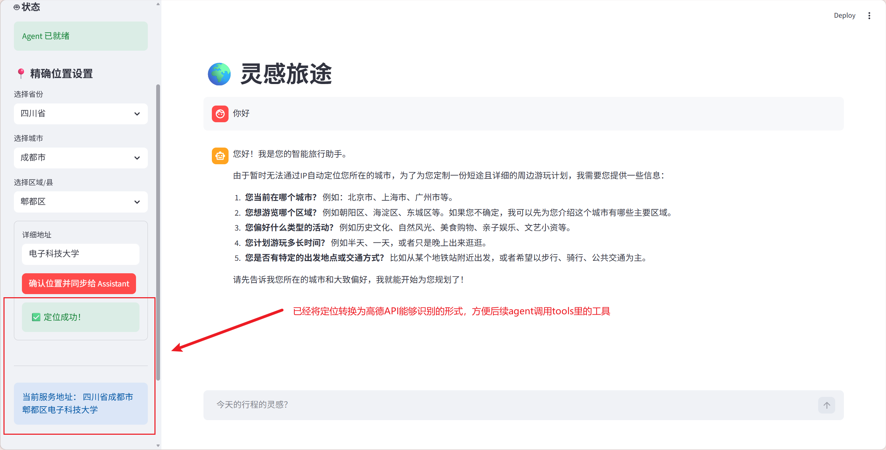
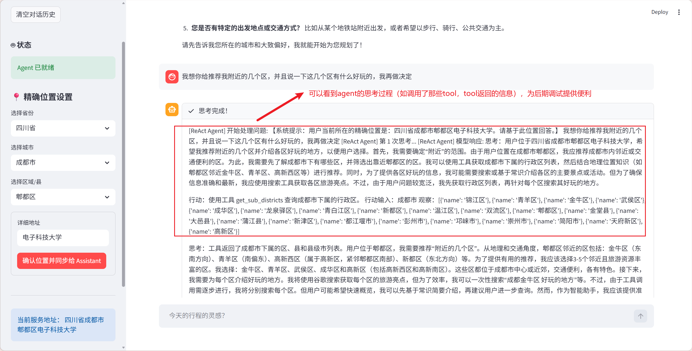
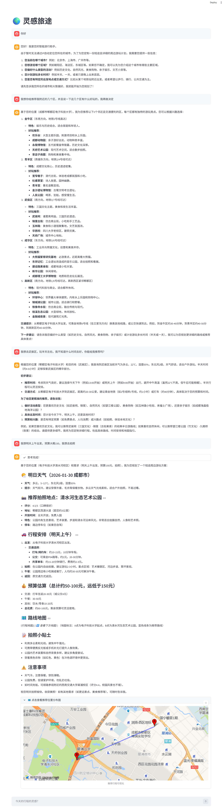

## 代码结构：
```
City-Outskirts-Tour-Agent/
├── app.py                # 项目启动入口 (Streamlit 界面)
├── config.py             # 配置文件 
├── .env                  # 环境变量 (放API_KEY，保护敏感隐私)
├── requirements.txt      # 依赖管理
├── core/
│   ├── agent.py          # ReactAgent 核心类 (逻辑中枢)
│   ├── prompt.py       # 结构化 Prompt 模板 (System Prompt)，**大白话：llm Cosplay的角色**
│   ├── llm_client.py    # 封转好的LLM调用类
 |   └── parser.py      # 正则/JSON 解析器 (处理模型输出)，**大白话：过滤模型的废话，得到有用信息**
├── tools/
│   ├── \_\_init\_\_.py       # 工具注册中心
│   ├── search_tool.py    # 联网搜索
│   ├── restaurant.py     # 餐厅数据库接口
│   ├── weather.py        # 天气接口
│   └── weather.py        # 天气接口
├── memory/
│   ├── manager.py        # 记忆清理逻辑 (LSTM 思想的实现)
│   └── db_handler.py     # 向量数据库读写
└── utils/
    └──logger.py         # 记录 Agent 思考过程，方便调试
 ```   
## 简介：

City-Outskirts-Tour-Agent是一个非常简单的React agent，如果你也是agent的初学者，这么City-Outskirts-Tour-Agent是一个非常适合适合新手使用的demo，你可以在`core/prompt.py` 中定义模型扮演的角色，例如我给的角色定义就是：“你是一位智能旅行助手。。。”





